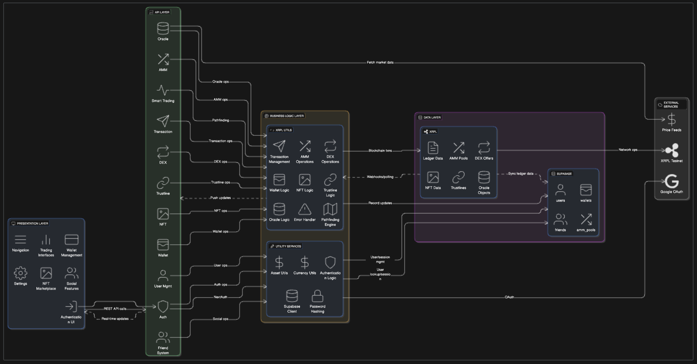

# XRPL MVP - Code Review Repository

⚠️ **This is a code review version with execution disabled and proprietary algorithms removed**

## License & Usage Notice

- This repository is provided solely for the purpose of evaluation by the BDAX review team.
- All intellectual property rights are retained by YONA, LLC.
- The code is licensed under the Business Source License 1.1 (BSL 1.1), included in this repository.
- Viewing and evaluation are permitted.
- Commercial use, production deployment, redistribution, modification, or derivative works are strictly prohibited without prior written consent from YONA, LLC.
- Proprietary algorithms have been removed; the full production system may be shared under NDA if required.
- By accessing this repository, you agree to these terms.

## Overview

This repository provides the full-stack implementation of a permissioned DeFi protocol on the XRP Ledger (XRPL), designed for regulated environments and architected for upcoming XRPL amendments.

## What's Included (Main Project)

### ✅ Complete Architecture
- **Frontend**: Modern Next.js 15 application with React 19
- **Backend APIs**: Comprehensive REST API endpoints for all trading operations
- **Database Integration**: Supabase integration with user management
- **Authentication**: NextAuth.js with Google OAuth
- **UI/UX**: Tailwind CSS with responsive design and modern components
- **Type Safety**: Full TypeScript implementation with comprehensive type definitions

### ✅ XRPL Integration
- **Wallet Management**: Create, import, and manage XRPL wallets
- **AMM (Automated Market Maker)**: Full AMM pool creation, liquidity management, and swapping
- **DEX (Decentralized Exchange)**: Order book trading with offer creation and management
- **Cross-Currency Payments**: Multi-hop payment routing
- **NFT Trading**: Mint, list, and purchase NFTs on XRPL
- **Trustlines**: Token trustline management
- **Transaction History**: Comprehensive transaction tracking and display

### ✅ Advanced Features
- **Smart Trading**: Favorites system and advanced trading panels
- **Friend System**: Social features with friend requests and management
- **Asset Management**: Portfolio tracking and asset visualization
- **Oracle Integration**: Price feed integration for accurate pricing
- **Multi-Wallet Support**: Support for both user and admin wallet types

## What's Removed for Code Review

### 🚫 Proprietary Algorithms Removed
The original sophisticated algorithms have been replaced with naive implementations:

**Pathfinding Engine** (`naivePathfinder.ts` replaces `corePathfindingEngine.ts`):

**Getting Transaction History** (`naiveTransactionFetcher.ts` replaces `getAccountTransactions.ts`):

**Cross-Currency Payment Engine** (`naiveCrossCurrencyPayment.ts` replaces `sendCrossCurrency.ts`):

### 🚫 Environment Variables & Secrets
- All `.env` files have been removed
- API keys, database credentials, and OAuth secrets excluded
- `.env.example` provided with dummy values
- Enhanced `.gitignore` to prevent future secret commits

### 🚫 Execution Capability
- Package.json marked as `"private": true`
- All npm scripts disabled with informative error messages
- Only `type-check` script remains for TypeScript validation

### 📹 Demo Video
A comprehensive demonstration of the platform's functionality is available at:
**[Demo Video - September 13, 2025](https://drive.google.com/file/d/1eJ6igXuBTha1iEOud__05bQ44tOXmb0V/view?usp=sharing)**

The video showcases:
- Complete user registration and wallet creation flow
- AMM pool creation and liquidity provision
- Cross-currency swaps and DEX trading
- NFT minting and marketplace functionality
- Real-time transaction execution on XRPL testnet

### System Architecture Diagram

*Complete system architecture showing frontend components, backend APIs, XRPL integration, and data flow between all layers.*
